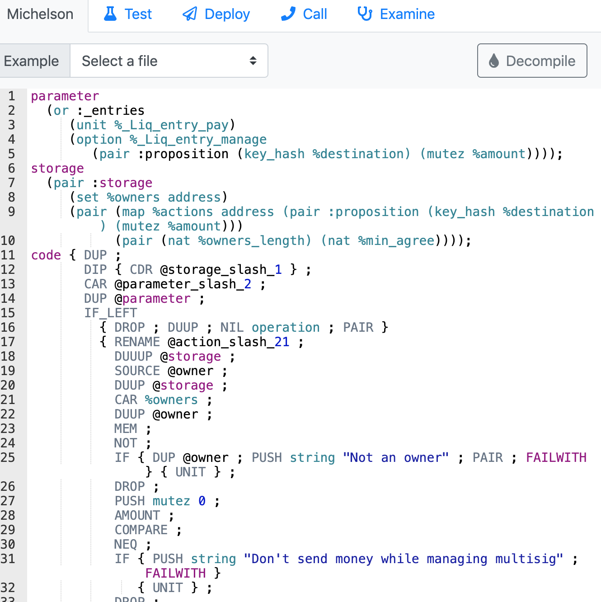
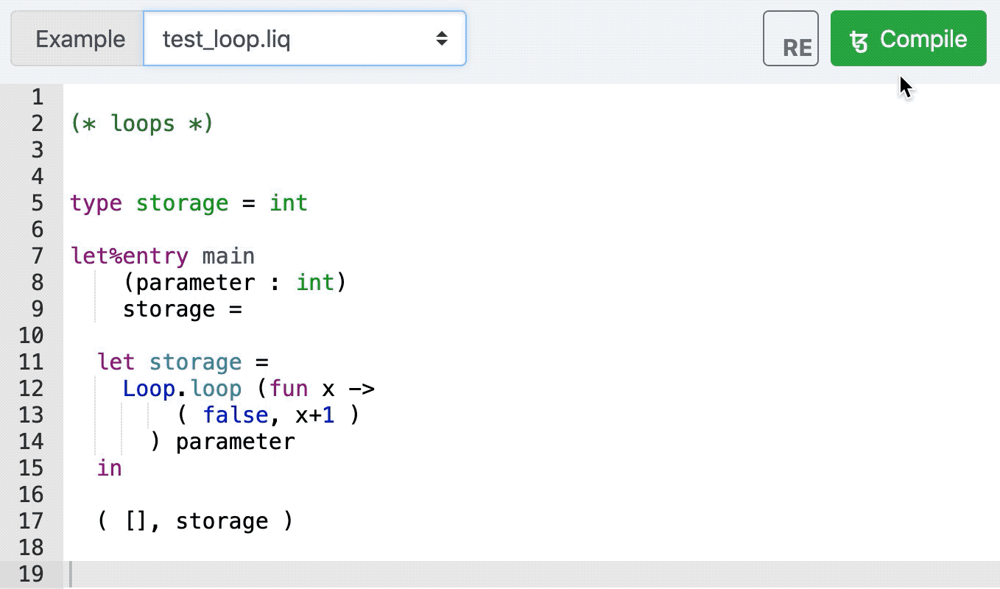

- [Purpose of the Verba Volant Scripta Manent (VVSM)](#purpose-of-the-verba-volant-scripta-manent-vvsm)
  - [MVP](#mvp)
    - [Possible further features](#possible-further-features)
- [Learning how to make a Tezos smart contract](#learning-how-to-make-a-tezos-smart-contract)
  - [Picking the language for the contract](#picking-the-language-for-the-contract)
    - [Michelson and Liquidity](#michelson-and-liquidity)
    - [The false hope of **fi**](#the-false-hope-of-fi)
    - [ReasonML syntax, a way to preserve sanity while writing Liquidity](#reasonml-syntax-a-way-to-preserve-sanity-while-writing-liquidity)
- [Reading material needed to start working](#reading-material-needed-to-start-working)

# Purpose of the Verba Volant Scripta Manent (VVSM)

VVSM is just a POC of how a distributed app (dapp) running on the Tezos Virtual Machine (TVM) can store data securely and consistently with the flexibility required by business users.

In this case we will build a periodic maintenance book where we will record a vehicle maintenance history

The features of VVSM will be as follow:

## MVP
* The contract will contain data structures called _Items_, which will contain information concerning the represented _item_ (e.g.: A motorcycle or other vehicle)
* The contract will contain informations regarding ownership of the _items_ (_Items_ will be owned by _Owners_)
* _Owners_ will be able to subscribe to the smart contract
* The item will have a history of _events_, that may contain a string or a number as value and will have a timestamp of when they were inserted
* No history _event_ will be deletable
* No Item will be deletable
* _Items_ ownership will be transferable
* Only an _Item owner_ will be able to add an _Event_ to an owned _item_, and only with a valid subscription

### Possible further features
* Enrich _item_'s info with a picture
* Encrypt _Owners_ information
* Add special data structures for service points, that are able to add events to an Item wothout being owners of said items
* Make _Service points_ able to edit an _Item_ only after the _Item's Owner_ has given them access to the item history
* Allow private _Items/history_ visible only to _Owners_ and authorized _Service points_
* Regulate an _Item_ transfer in exchange of money, having the smart contract act as Escrow
  * Taxes/fees?

# Learning how to make a Tezos smart contract
## Picking the language for the contract
The first thing to do is obviously to find out how to write the code for the contract.

### Michelson and Liquidity
Being an ICO supporter and having seen the birth of this project I know that the TVM uses Michelson, a quasi-assembly hideous and unreadable language that *IMHO* is not supposed to be read by humans.
  
Although that's not an option (Akin to the Bytecode on the JVM), the Tezos ecosystem has a more human-compatible option: Liquidity, a language based on oCaml syntax (Funtional fanboys are gonna love it), which I never used or studied before.

After a couple of very discouraging tries I gave up on it (because I'm lazy AF), and decided that the ReasonML syntax variant was going to probably be equally anti-intuitive to an Object Oriented guy as myself.
You are obviously very encouraged to learn it as-is, being the official language used in the community.

### The false hope of **fi**
I have also heard some time ago about about **fi**, a very easy to read/write  language that compiles to liquidity and looks very similar to javascript.  
Very promising. Very misleading.  
I was very excited, and wrote the first draft of the contract using it, but soon realized that the mantainers of that project haven't yet got around to porting all the liquidity features (I'm not talking about Type inference, I'm talking abount *functions*, which is a goddamn composite type in liquidity, stuff you're gonna need if you write something more complex than a voting contract).

I sincerely hope it will reach an usable state for more than simple contracts, I **REALLY** like it. But it wasn't enough for my project, you are, however invited to keep tabs on it's development and use it if it suits your needs

### ReasonML syntax, a way to preserve sanity while writing Liquidity
Cool, back to liquidity it was... but at least I decided to use the ReasonML syntax, which gave me a lot less headaches (I like parentheses more than I like dumb functional conventions).

# Reading material needed to start working
Everything you'll need is available through [Tezos.help](https://www.tezos.help/).  
I suggest you start by loking at the [free Zastrin course](https://www.zastrin.com/courses/simple-tezos-dapp/lessons/1-3) and then read the better and more complete [Tezos capstone](https://tezoscapstone.com/) docs.

The actual development of the contract was done using the [liquidity-lang online editor](http://www.liquidity-lang.org/edit/) all while keeping ready on a tab the [official Liquidity Reference](http://www.liquidity-lang.org/edit/doc/reference/liquidity.html#).